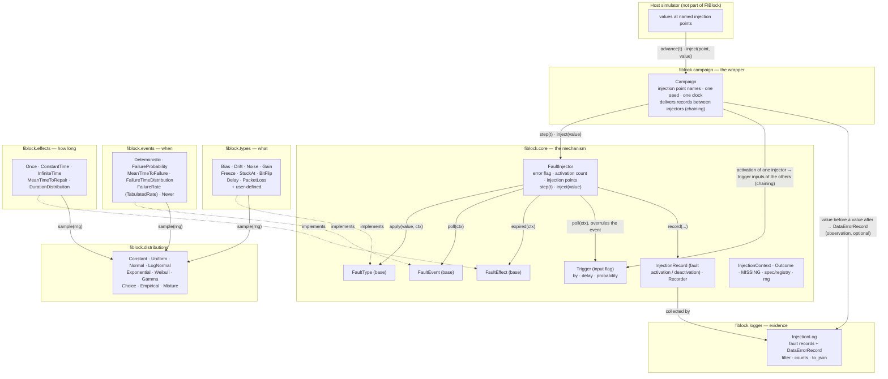

# FIBlock architecture

FIBlock keeps the structure of the original Simulink block: a fault injector is
the combination of a **fault type** (what the error looks like, with its fault
value), a **fault event** (when it activates) and a **fault effect** (how long
the error lasts). Each of the three is chosen independently. Around the
injector sit two things that were separate in the original tool as well: the
**campaign** (the wrapper that wires several injectors together, once the
`wrapper` function and the global injector map) and the **logger** (the record
of injection points, once the block's `FInjectionPoints` and `Fflag` outputs).
The block's trigger input `Iflag`, which overrules the parameters and forces an
injection, is the injector's `Trigger`; wiring one block's flag output to
another's trigger input is chained fault injection.

## Layers and what they may know

| Package | Role | Knows about |
|---|---|---|
| `fiblock.core` | the mechanism: `FaultInjector` with its `Trigger` input, the three base classes, context, outcome, records, spec/registry, random streams | only the base interfaces; no concrete type, event or effect |
| `fiblock.types` | fault types, one module each | the `FaultType` interface and distributions |
| `fiblock.events` | fault events, one module each | the `FaultEvent` interface and distributions |
| `fiblock.effects` | fault effects, one module each | the `FaultEffect` interface and distributions |
| `fiblock.distributions` | sampling | nothing else |
| `fiblock.campaign` | the wrapper: injection point names, seeding, clock, chaining, spec export | core and logger |
| `fiblock.logger` | evidence: fault-injection records collected from the mechanism, data-error records observed by the campaign; filtering, exporting | core records only |

Dependencies point downward only: the campaign uses the core, the core uses
nothing above it. A fault type never sees an event or an effect. An event
never sees a fault type. The logger never sees injection code.

## Faults, errors, failures

FIBlock follows the dependability vocabulary of Laprie and Avizienis. A
**fault** is what FIBlock injects: it is activated at an injection point for
some exposure and then removed. An **error** is an incorrect value in the
data: an active fault may or may not produce one (a packet-loss fault with
probability 0.3 corrupts some values, a freeze corrupts none until a value
arrives). A **failure** is the system no longer delivering its function.

The injection mechanism deals with faults only: its records are fault
activations and deactivations. Whether a value leaving an injection point is
erroneous is an *observation* made by the campaign by comparing the value
before and after the point; it is reported in the `Outcome` (`data_error`,
`caused_by`) and, when `record_data_errors=True`, stored as a
`DataErrorRecord` next to the fault records, so that the evidence exists.
FIBlock says nothing about how a data error propagates beyond the injection
point, and nothing about failures; both belong to the host system.

## Life of one injector

1. `reset` — the fault type clears its state, the fault event draws whatever it needs (e.g. a failure time), the trigger input is cleared.
2. `step(t)` — if the error flag is up and the fault effect says *expired*, the flag goes down (a `deactivation` record). Then, if dormant and eligible, the trigger input is polled first (it overrules the event), then the fault event; if either says *now*, the flag goes up, the effect draws its duration, the fault type's `on_activate` runs (an `activation` record).
3. `inject(value)` — the fault type observes the value; if the flag is up, `apply` runs and the resulting value (or `MISSING`) is returned. The campaign compares the value before and after the point and reports a data error if they differ.
4. The campaign hands every record to every injector's trigger input; a trigger that recognises its source schedules an activation, and the campaign polls again until nothing new fires, so chains resolve within the step. `campaign.activate(name)` is the same input driven by the host.

## Terminology map

| Original FIBlock (Simulink / RLFI code) | Python |
|---|---|
| FIBlock instance (`FaultInjector` class, `finject`) | `FaultInjector`, `step` + `inject` |
| fault type, fault value | `FaultType` subclass, its `value` parameter |
| fault event, event value | `FaultEvent` subclass and its parameters |
| fault effect, effect value | `FaultEffect` subclass and its parameters |
| Noise / Bias-Offset / Bit flips / Stuck-at / Time delay / Package drop / Drift | `Noise` / `Bias` / `BitFlip` / `Freeze`, `StuckAt` / `Delay` / `PacketLoss` / `Drift` |
| — (the gain / scaling fault of the sensor-fault literature, the loss of effectiveness of the actuator literature) | `Gain` |
| Failure probability / Mean Time To Failure / Deterministic / Probability distribution / Manual distribution | `FailureProbability` / `MeanTimeToFailure` / `Deterministic` / `FailureTimeDistribution` / `FailureRate(TabulatedRate)` |
| Once / Constant time / Infinite time / Mean Time To Repair / Weibull, Gamma, ... durations | `Once` / `ConstantTime` / `InfiniteTime` / `MeanTimeToRepair` / `DurationDistribution` |
| trigger input `Iflag` (overrules the parameters), chained fault injection (`Fflag` → `Iflag`) | `FaultInjector(..., trigger=Trigger(by=...))`; the campaign delivers the activation records; `campaign.activate(name)` drives the input by hand |
| enable checkbox | `enabled=` |
| `Fflag` (error flag), `FInjectionPoints` | `injector.error_flag`, `injector.injection_points` |
| `wrapper` + global `finjectors` map | `Campaign` with named injection points |
| — | `Never` (an injector with no event of its own) and the `DataErrorRecord`: additions |
